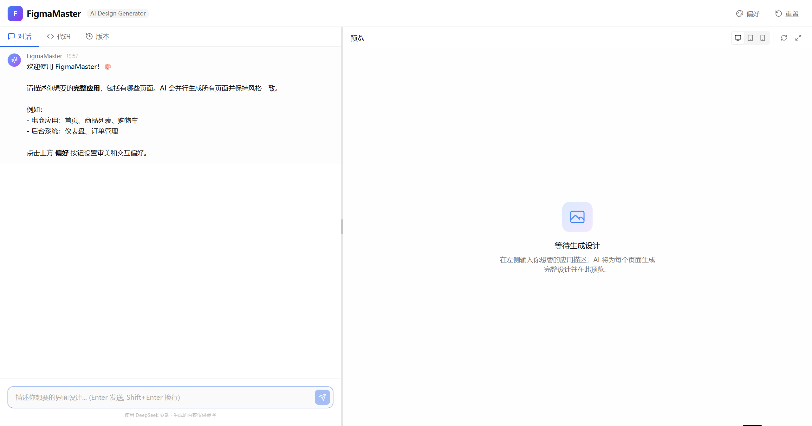
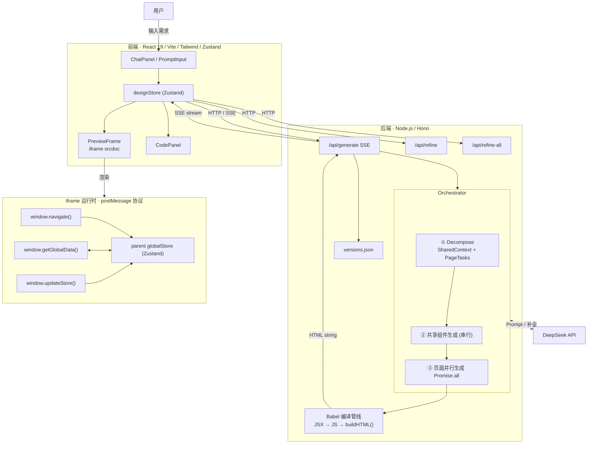

# FigmaMaster

自然语言 → 多页面应用设计，实时预览。输入"做一个电商应用，包含首页、商品列表、购物车"，一次生成完整可交互的多页面应用。

## UI



## 架构图



## 技术决策

### 并行多页面

decompose用户的需求为多个页面,并行生成提高速度.

**Decompose → 并行生成页面 → Promise.all请求LLM**

```
用户 Prompt → LLM Decompose(1次调用)
              → 产出 SharedContext { primaryColor, navigation[], userObject, commonStyles }
              → 产出 SharedComponents [{name, description, props}]
              → 产出 PageTasks [{首页, 商品列表, 购物车}]
                         ↓
              先生成共享组件 (串行, 1-3次 LLM 调用)
              → 产出组件 JSX 代码
              → 注入到每个 page prompt
                         ↓
              Promise.all 并发数可控
              → 每个 page prompt 以 SharedContext + 组件代码为前缀
              → 所有页面共享主色、统一导航结构、相同的用户数据模型
              → 且共享组件由 LLM 引用已有的代码，不再各自生成
```

并发数通过 `DEEPSEEK_CONCURRENCY` 控制，避免过大的对LLM的同时请求

### 跨页一致性：共享上下文 + 共享组件生成

使用SharedContext和结构性的组件注入保证多页面的**跨页一致性**——每页 LLM 独立生成会导致颜色、导航、数据结构各不一致.

decompose 阶段不仅分解出页面，还会识别**共享组件**（导航栏、页脚、侧边栏等跨页面复用的 UI 元素）。这些组件在页面并发生成**之前**先生成好，得到的 JSX 代码作为"组件库"注入到每个页面的 prompt 中：

```
用户 Prompt → Decompose
              → SharedContext { colors, navigation, ... }
              → SharedComponents [{NavBar, Footer, ...}]  ← 新增
              → Pages [...]
                         ↓
              ✦ 先生成每个共享组件的 JSX（串行）
              ✦ 将生成的代码注入到每个页面的 prompt 里
              ✦ 告诉 LLM "直接用下面的组件，不要自己重写"
              ✦ 并行生成页面（组件代码已在上下文中）
```

好处是：

- **结构性保证** — 页面拿到的是实际组件代码，不是一段自然语言描述，LLM 无法"忘记"保持一致
- **覆盖任意元素** — 不写死，由 decompose 阶段决定哪些是共享组件
- **修改也简单** — 改一个组件重新生成，所有页面自动更新

修改阶段用**批量 refine**：用户说"所有页面加底部导航"时，前端自动识别关键词（所有页面 / 统一 / 全站），路由到 `POST /api/refine-all`。该端点接收 sharedContext + 全部页面 JSX + 共享组件代码，逐个喂给 LLM 带共享上下文修改，保证输出组件一模一样。

### Babel 编译管线：LLM 不出 HTML

```
LLM → JSX only
     → Babel transformSync (preset-react, automatic runtime)
     → 失败 → 错误信息 + 原 JSX 喂回 LLM 修复，最多重试 2 次
     → 成功 → normalizeJS (去 export default, 加 const App = ...)
            → buildHTML() 自建完整 HTML（importmap + root div + inline script）
            → 前端只收零 JSX 语法的纯净 HTML
```

`buildHTML()` 是 HTML 的**唯一来源**，LLM 永远不碰 HTML 字符串。

### 运行时容器：postMessage 通信协议

多页面不是多个独立 HTML——是一个**单 iframe 容器**，页面间通过 postMessage 通信：

```
┌─ 主页面 ─────────────────────────────┐
│  globalStore { user, cart, session }  │
│  currentPages [首页, 商品, 购物车]      │
│  activePageIndex                      │
│                                       │
│  ┌─ iframe ────────────────────────┐  │
│  │  <script> 注入:                  │  │
│  │  window.navigate(page, params)  │  │
│  │  window.getGlobalData() → Promise│  │
│  │  window.updateStore(payload)    │  │
│  │  window.placeholder(w,h,text)   │  │
│  │  </script>                       │  │
│  │                                   │  │
│  │  <button onClick={() =>          │  │
│  │    navigate('product',{id:1})    │  │
│  │  }>查看商品</button>              │  │
│  └──────────────────────────────────┘  │
│            ↑↓ postMessage              │
└────────────────────────────────────────┘
```

System Prompt 约定 LLM 用 `navigate()` 替代 `<a href>`，用 `getGlobalData()` 读全局状态，用 `updateStore()` 持久化。生成的页面不需要 React Router，不需要知道路由实现细节。

### 全局状态保持：页面切换不丢数据

多页面切换最大的问题是状态丢失——用户在 A 页加购物车，到 B 页不能丢。方案是 **parent 持有状态，iframe 只读写**：

```
用户浏览商品 → 点击"加入购物车"
       ↓
  iframe 调用 updateStore({ cart: [...] })
       ↓ postMessage
  parent 接收 → 更新 Zustand store (globalStore)
       ↓
用户导航到购物车页
       ↓
  iframe 调用 getGlobalData()
       ↓ postMessage (parent → iframe)
  parent 返回 { user, cart, session }
```

关键点：

- **Zustand `globalStore` 是唯一数据源**，存放在 parent（主应用），不在 iframe 里
- **iframe 是无状态的渲染器** — 只根据 `getGlobalData()` 拿到的快照渲染，不持久化任何数据
- **`srcdoc` iframe 切换不会丢失 parent 状态** — 即使整个 iframe 内容替换，`globalStore` 依然在 parent 的 React 树中
- **数据协议全部通过 postMessage 同步**，无需后端，零延迟
- **导航切换不触发页面重新生成** — 所有页面在初始阶段已并行生成完成，切换只是换 iframe 展示哪个 HTML

### Context Saving

**只保留最新版本的代码，不保留历史**

用户每次修改，context 里只放 **当前最新的 JSX** ，不需要每个历史版本：

```
❌ 错误：把每次修改前后的代码都塞进 context
✅ 正确：context 里永远只有一份最新代码 + 本次指令
```

**历史对话做摘要压缩**

超过一定轮数之后，把早期对话压缩成摘要：

```
原始：10轮对话，3000 token
压缩：一段摘要，200 token
"用户做了一个电商首页，主色调蓝色，包含导航栏、banner、商品列表"
```

**代码不进 context，只传 diff**

用户说"把按钮改成红色"，不需要把整个 JSX 传进去，只传相关片段，LLM 返回 diff，后端合并。

**按页面隔离 context**

每个页面维护独立的 context，不要把所有页面代码塞进同一个 context。


### 后端框架选型

Node.js (Hono)。决策过程：

- Go → Node.js：Babel 是 Node.js 生态的核心依赖，Go 调用 Babel 需要 `os/exec` 子进程，每次 JSX 编译延迟 200-500ms。同进程调用 Babel API 零开销。
- Express → Hono：Hono 原生支持 Web Standard (`Request`/`Response`)，内置 `streamSSE()` 和 `cors()`，路由写法更简洁，TypeScript 类型推断优于 Express。

## 技术栈

Node.js · Hono · DeepSeek · Babel · React 19 · Vite · Tailwind · Zustand

## 未来规划 & 已探索方向

### 多 iframe 预加载

最初是单 iframe 方案，页面切换 = 销毁重建 → 500ms+ 白屏。改为所有页面同时存在、仅 toggle `display:none/block`，切换到 <16ms。代价是首次加载时所有 iframe 并行初始化 React，但浏览器缓存 ESM 模块后实际可接受。

**衍生问题**：预加载的 iframe 在隐藏时已 mount 过 React，`getGlobalData()` 返回的是初始空 store。后续 `updateStore` 只更新 parent 端，iframe 内不知道。解决方案是 runtime 里加 `init` 事件 + `storechange` CustomEvent，parent 切换页时推最新 store，组件用 `useEffect` 监听重新取数。

### 增量页面添加

用户说"生成一个商品详情页"时，keyword 检测（`生成一个`/`加一个`/`添加`）路由到 `addPage`，只调用 refine 端点生成新页，不触发全量 decompose。新页 append 到 `currentPages`，老页面不动。

**遗留问题**：加页后老页面的导航栏不会自动更新（缺少新页入口）。LLM 级解决方案成本太高（需 refine-all），HTML 字符串级别的 patching 不够可靠。方向是共享组件形式——导航栏抽成独立组件注入所有页面，加页时只改组件一次。

### 增量页面加后老页面导航栏同步

尝试过 `addPage` 后自动 `refineAllPages` 触发导航栏全局更新，但双 SSE 流冲突导致崩溃。改为 `patchNavIntoPages`——纯字符串匹配 `navigate()` 按钮位置并插新 button。问题是各页面导航栏结构不统一，匹配不稳定。根因是 LLM 自由发挥导致每页导航代码结构不同。

**结论**：导航栏这类跨页面共享元素不应靠 LLM 各自生成，而应由系统保证——要么预先注入共享组件 JSX，要么用人工模板替换。这也是「组件库」方向的动力。

### 人工严选组件库（方向）

当前完全依赖 LLM 生成组件代码，跨页一致性靠 prompt 约束 + 共享上下文维持，但多轮迭代中仍不稳定。

下一步计划构建**多风格 Palette + 组件模板库**：

- **多风格 Palette**：每个 Palette 包含主题 token（色板、圆角、间距、字体），覆盖「活泼电商」「极简工具」「后台管理」
- **组件模板库**：NavBar、Footer、Card、TabBar 等高频组件，每 Palette 2-3 套手写模板
- **LLM 角色转变**：从"生成一切"变成"拼装组件"，只需选择哪个 Palette + 填充内容数据

优势：审美确定性、组件复用、迭代一致性、渐进覆盖（高频组件模板兜底，长尾 fallback LLM）。

## 启动

```bash
npm install && npm run dev    # server :3001 + client :5173
```
